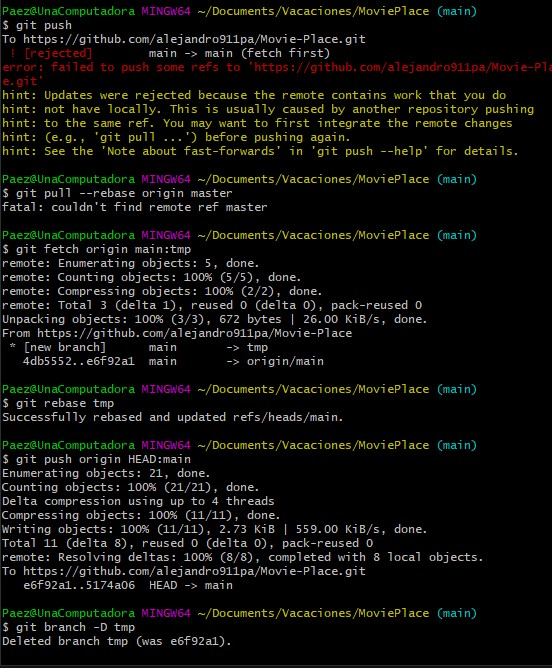

# Ayuda-github
codigos en caso no se pueda actualizar los cambios



```
git pull --rebase origin master
git fetch origin main:tmp
git rebase tmp
git push origin HEAD:main
git branch -D tmp
```
## para subir una actualizacion de codigo a github se usan los comandos se pone otro nombre en dnde dice prueba
```
git add .
git status
git commit -m "prueba"
git push -u origin main
```
# Link para ayuda de Sintaxis para editar README
[poder escribir mejor readme](https://docs.github.com/es/get-started/writing-on-github/getting-started-with-writing-and-formatting-on-github/basic-writing-and-formatting-syntax).


<picture>
  <source media="(prefers-color-scheme: light)" srcset="https://user-images.githubusercontent.com/25423296/163456779-a8556205-d0a5-45e2-ac17-42d089e3c3f8.png">
  
</picture>


> AlejandroP
